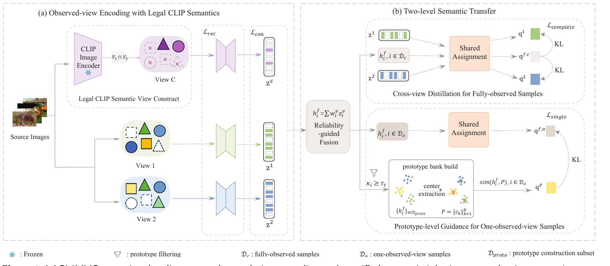

# LASI-IMVC

Official compact implementation of Legality-Aware Semantic Inheritance for Incomplete
Multi-View Clustering (LASI-IMVC) on Scene15. This release contains one dataset, one aligned
CLIP feature cache, the final model, and one experiment configuration. Historical ablations,
unrelated datasets, notebooks, generated results, and duplicate implementations are excluded.



## Project structure

```text
LASI-IMVC/
├── config/
│   └── Scene15.yaml
├── data/
│   ├── Scene_15.mat
│   └── clip_cache/
│       └── scene15_vitb32/
│           └── clip_img_feat.pt
├── docs/
│   └── assets/
│       ├── model_framework.pdf
│       └── model_framework.png
├── models/
│   ├── model.py
│   └── losses.py
├── trainers/
│   ├── joint_trainer.py
│   └── pretrain_trainer.py
├── dataset_loader.py
├── engine_train.py
├── main_train.py
├── utils.py
├── environment.yml
└── requirements.txt
```

The published protocol uses the first two feature views in `Scene_15.mat`. CLIP features are
appended as a third semantic view. Under the strict missing-view protocol, the CLIP view is
available only when both source views are observed; it is never restored for an incomplete
sample.

## Installation

Python 3.10 or newer is recommended. Create the Conda environment with:

```bash
conda env create -f environment.yml
conda activate lasi-imvc
```

Alternatively:

```bash
python -m venv .venv
python -m pip install --upgrade pip
python -m pip install -r requirements.txt
```

For CUDA training, install the PyTorch build matching your CUDA runtime by following the
[official PyTorch installation guide](https://pytorch.org/get-started/locally/).

## Training

Run the default five-seed Scene15 experiment:

```bash
python main_train.py --config config/Scene15.yaml
```

Useful command-line overrides:

```bash
python main_train.py --device cuda:0 --seeds 0
python main_train.py --missing-rate 0.3 --mask-seed 1
python main_train.py --output-dir outputs/custom_run
```

Each seed is written to a separate directory. Aggregate metrics are saved as `summary.csv` and
`summary.json` under the configured output directory.

## Configuration

`config/Scene15.yaml` keeps the dataset facts and the paper-facing settings visible:

- `num_classes` and `num_samples_total`;
- `shared_dim`, `encoder_hidden_dims`, `decoder_hidden_dims`, and `norm`;
- `lambda_view_distill` and `lambda_single_proto`;
- `tau_t`, the teacher-confidence threshold;
- `tau_p`, the prototype-confidence threshold.

Stable implementation details remain in `main_train.py`. Unknown YAML keys and mismatches
between configured and loaded Scene15 metadata are rejected early.

## Reproducibility and fairness

- Missingness is generated only for the two original Scene15 views.
- The missing rate denotes the fraction of incomplete samples.
- Every incomplete sample retains exactly one original view.
- The CLIP mask is the logical AND of the two source-view masks.
- Missing views are not encoded or used as reconstruction targets.
- K-means evaluation uses `n_init=10` and a fixed training seed.

## Data notice

The repository includes `Scene_15.mat` and its aligned cached CLIP features solely to make the
released experiment self-contained. Users remain responsible for complying with the original
dataset terms and citing the corresponding Scene15 source in publications.

## License

The code is released under the MIT License. Dataset and derived feature rights may be governed
by the terms of their original sources.
